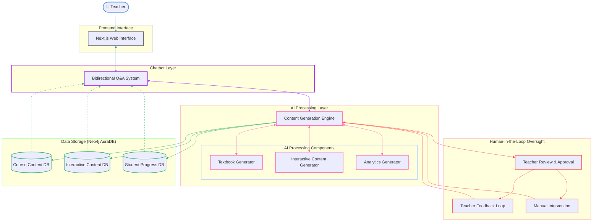
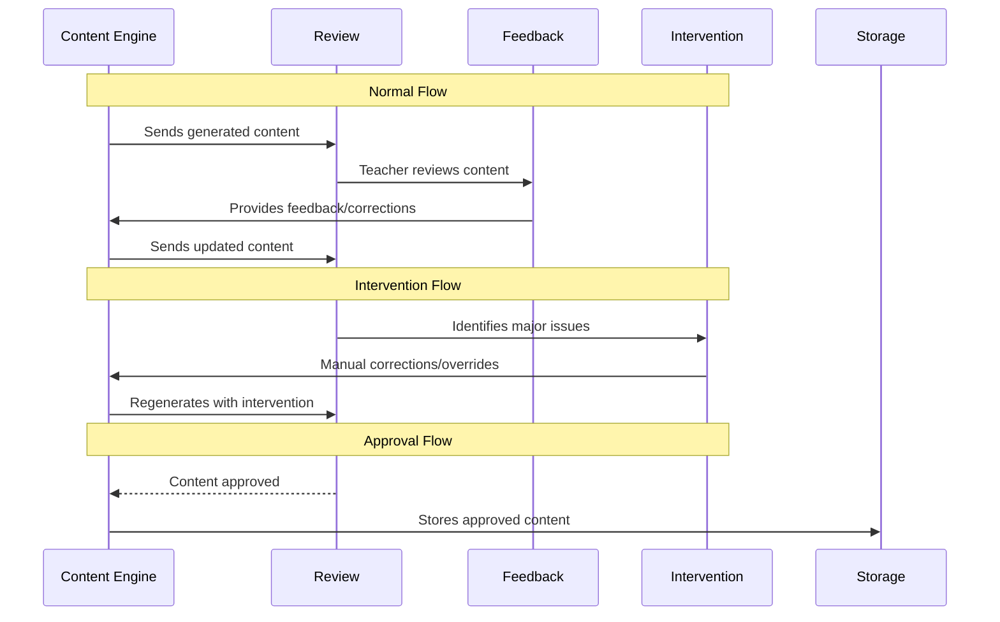

# Mutli-Agent-Teacher-Bot-Architecture



# Human In Loop Flow

Here's the content formatted in Markdown:

# Human-in-the-Loop Flow Patterns

## 1. Normal Flow

```
Content Engine → Review → Feedback → ContentEngine
      ↑_______________________|
```

* Content is generated
* Teacher reviews
* Feedback provided
* Content is regenerated with improvements

## 2. Intervention Flow

```
Review → Intervention → ContentEngine
   ↑__________________________|
```

* Serious issues identified
* Manual intervention triggered
* Direct corrections made
* Content regenerated with overrides

## 3. Approval Flow

```
Review → ContentEngine → DatabaseStorage
```

* Content meets all standards
* Approved by teacher
* Stored for use in system

## Key Benefits

### 1. Quality Assurance
* Ensures educational standards
* Maintains content accuracy
* Verifies appropriateness

### 2. System Improvement
* Feedback helps improve AI generation
* Creates learning opportunities
* Refines content quality

### 3. Safety and Control
* Prevents inappropriate content
* Maintains educational standards
* Provides emergency override capability
